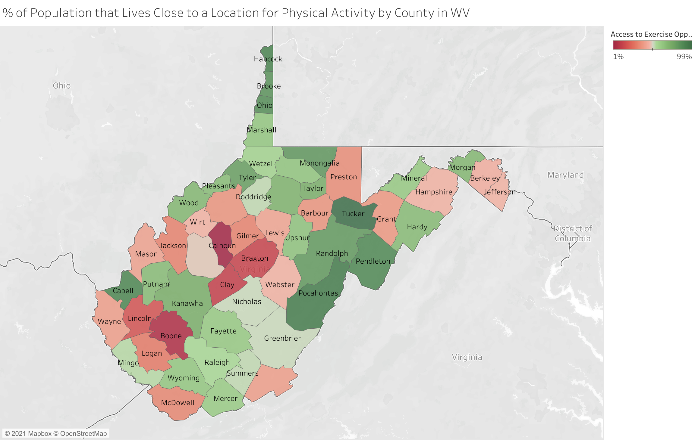
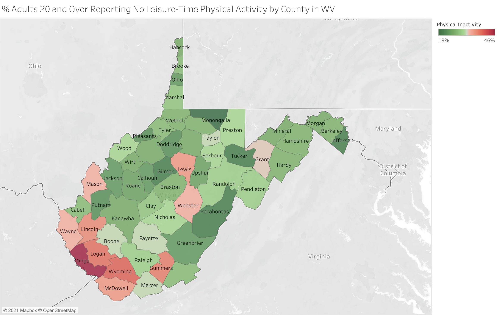
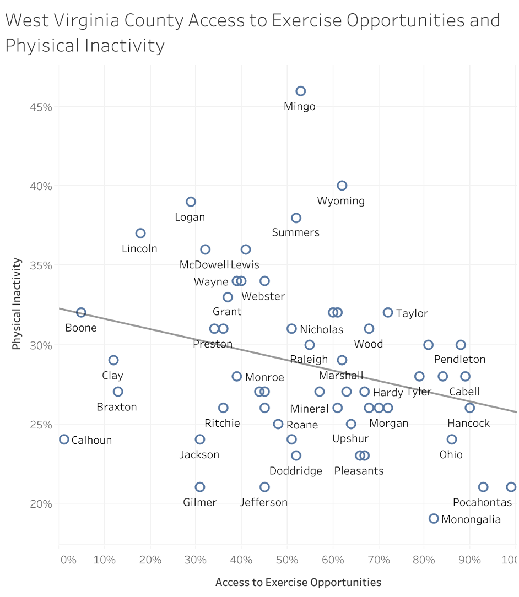

# West Virginia County Access to Exercise Opportunities and Physical Inactivity 
    Joel Patrick Steadman Breit
    2021

## Background

As described by the County Health Rankings and [Roadmaps website](https://www.countyhealthrankings.org/explore-health-rankings/measures-data-sources/county-health-rankings-model/health-factors/health-behaviors/diet-exercise/physical-inactivity), “Decreased physical activity has been related to several disease conditions such as type 2 diabetes, cancer, stroke, hypertension, cardiovascular disease, and premature mortality, independent of obesity. Inactivity causes 11% of premature mortality in the United States, and caused more than 5.3 million of the 57 million deaths that occurred worldwide in 2008. In addition, physical inactivity at the county level is related to health care expenditures for circulatory system diseases. Physical activity improves sleep, cognitive ability, and bone and musculoskeletal health, as well as reduces risks of dementia. Physical inactivity is not only associated with individual behavior but also community conditions such as expenditures on recreational activities, access to infrastructure, and poverty.”

## Goal

The goal of this research was to assess the relationship between county level and activity levels and county level access to exercise opportunities in the 55 counties in West Virginia for the year 2021 when I conducted this research. 

## Methods

I retrieved the access to exercise opportunities and inactivity data for this research collected from the County Health Rankings and Roadmaps [website](https://www.countyhealthrankings.org). This website is a part of the [University of Wisconsin Population Health Institute](https://uwphi.pophealth.wisc.edu/) and provides a great deal of resources on county health data. The access to exercise opportunities data is a calculation based on census blocks of what proportion of the population in a county meets one of the following three criteria: 1) they are less than half a mile from a park 2) they are less than a mile from an urban recreation facility or 3) they are less than 3 miles from rural recreational facility. The physical inactivity values represent the percent of adults 20 and older in each county who have reported no leisure time physical activity.

## Analysis

The figures and maps I include in this report were generated using the statistics and visualization tool [Tableau](https://www.tableau.com) which I also used for calculating p-values, R-Squared values, and slopes. Those Tableau visualizations can be found here. The confidence intervals were calculated using the statistical tool [JMP](https://www.jmp.com/en_us/home.html).

## Results

The access to exercise opportunities estimates ranged from 1% (Calhoun County) to 99% (Tucker County), and the inactivity data ranged from 19% (Monongalia County) to 46% (Mingo County).
I created two maps to visualize the West Virginia counties that had the highest and lowest access to exercise opportunities data and inactivity data. In the access to exercise opportunities map (Figure 1), red represents the counties with the least access to exercise opportunities and green represents the counties with the greatest access to exercise opportunities; in the inactivity map (Figure 2), red represents the counties with the highest level of self-reported inactivity and green represents the counties with the lowest levels thereof.

### Figure 1 - average access to exercise opportunities by county in West Virginia

### Figure 2 - Rate of self-reported inactivity in West Virginia Counties

As can be seen in the above maps, there are some similarities, but a pattern is not immediately obvious. In order to assess if there was a statistical correlation between these two factors, I plotted them on a graph (Figure 3) and added a linear regression line (line of best fit).

### Figure 3 - Access to Exercise Opportunities and Physical Inactivity Levels in West Virginia Counties

As can be seen in Figure 3, there is a negative relationship between access to exercise opportunities and physical inactivity in these counties for the year 2021. However, the graph shows only a slight downward slope. Statistical tests were thus used to assess the certainty of this relationship and the predictive power of the latter on the former.
First, the p-value, which represents the likelihood that this relationship between access to exercise opportunities and physical inactivity was due to a false positive was 0.04. This implies that, given the characteristics of this county data such as variation from the means, and assuming that there actually was no relationship between those two variables, and all else being equal there would be a 4% chance of a relationship between these two variables being at least this strong. 
Second, the R-Squared statistic, which represents the portion of variability in a dependent variable (in this case, physical inactivity) that is due to the change in an independent variable (in this case, access to exercise opportunities), is 0.08. This implies that the average level of access to exercise opportunities accounts for 8% of the variation in activity levels between counties.
Finally, the slope of the line which represents - in this case - what percent of the population would be expected to switch between inactive and active given a 100% change in access to exercise opportunities was -0.065. This implies that the maximum amount of change in activity level that could be affected by changing access to exercise opportunities in a county would be 6.5%. To provide a more concrete example, all else being equal, and assuming no side effects, increasing access to exercise opportunities from the WV minimum (1%) to the WV maximum (99%) could help 6.4% (with a 95% confidence interval of 0.4% to 12.4%) of a county’s population become active.

## Limitations

This research and the data that I used for it had several limitations which should be pointed out now. First of all, county level data was used for convenience and accessibility, but this kind of broad, area-based data which is based on arbitrary county lines and includes counties of significantly different sizes is not ideal for assessing the relationship between these two variables. Second, the values assigned to these counties were based on averaging census block data. Many of the counties in West Virginia have very small population sizes and thus may consist of a very small number of census blocks. These census blocks locations were used for assessing proximity to parks and recreational facilities, and therefore may have limited the data points for each county to a very small number which could've lied to highly variable values due to random chance. Third, the definition used to assess accessibility to exercise opportunities only included parks and recreational facilities and only took into account direct distance. Well this may make for a useful estimate, proximity is not the same thing as accessibility, especially in a state with complicated terrain and commonly limited infrastructure. The definition of access to exercise opportunities also does not include things like sidewalks or malls and schools which might have programs available for county members to participate in. Ideally, this research could be done on an individual level comparing individual households’ proximities to opportunities such as the ones listed above and the activity levels of the members of each household.

## Implications

While it was useful to see that even on the county level, some relationship can be demonstrated between access to exercise opportunities and in activity levels, I do not recommend that the results of this research be relied upon to assess the general relationship between the two. Although the p-value is 0.04 which is generally labeled as "statistically significant,” only 8% of the variability could be explained by the independent variable, and this data is heavily obscured by the randomness of arbitrary groups being lumped together. I believe this research should be supplemented with more granular data so that the relationship between these two variables can more reliably be assessed.